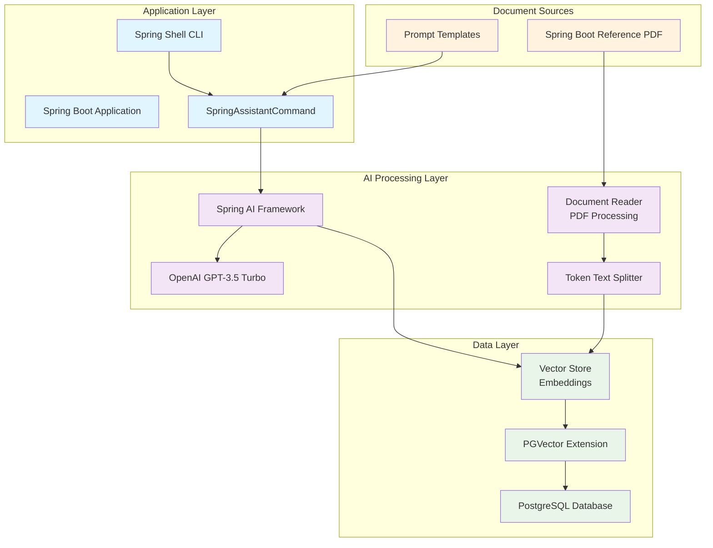

# Spring Boot RAG (Retrieval-Augmented Generation) System

A demonstration of implementing the RAG pattern using Spring Boot, Spring AI, PostgreSQL with PGVector, and OpenAI's GPT models. This application ingests PDF documentation and provides intelligent Q&A capabilities through a command-line interface.

## 🏗️ System Architecture



## 🔧 Components Overview

- **Document Ingestion**: Automatically loads and processes PDF documents into vector embeddings
- **Vector Database**: PostgreSQL with PGVector extension for semantic similarity search
- **AI Chat**: OpenAI GPT integration for generating contextual responses
- **CLI Interface**: Spring Shell for interactive querying
- **RAG Pipeline**: Retrieves relevant documents and augments AI responses

## 🚀 Getting Started

### Prerequisites

- Java 21+
- Maven 3.6+
- Docker and Docker Compose
- OpenAI API Key

### 1. Clone the Repository

```bash
git clone <repository-url>
cd springboot-ai-rag-docingest
```

### 2. Set Up Environment Variables

```bash
export OPENAI_API_KEY="your-openai-api-key-here"
```

### 3. Start PostgreSQL Database

#### Using Docker Compose (Recommended)
```bash
docker-compose up -d
```

#### Using Docker Command Directly
```bash
docker run -d \
  --name pgvector-db \
  -e POSTGRES_DB=aidocs \
  -e POSTGRES_USER=admin \
  -e POSTGRES_PASSWORD=password \
  -p 5432:5432 \
  ankane/pgvector:latest
```

### 4. Build and Run the Application

```bash
# Build the application
./mvnw clean compile

# Run the application
./mvnw spring-boot:run
```

The application will automatically:
1. Connect to the PostgreSQL database
2. Create the vector store schema
3. Load and process the Spring Boot reference PDF
4. Generate embeddings and store them in the vector database

### 5. Using the Application

Once started, you'll see a Spring Shell prompt. Use the following commands:

```bash
# Ask a question about Spring Boot
shell:> q "How do I configure a DataSource in Spring Boot?"

# Ask another question
shell:> q "What are Spring Boot starters?"

# Exit the application
shell:> exit
```

## 🔧 Development Commands

```bash
# Run tests
./mvnw test

# Build for production
./mvnw clean package

# Build native image (requires GraalVM)
./mvnw -Pnative native:compile

# Clean build artifacts
./mvnw clean
```

## 📊 How It Works

1. **Document Loading**: On startup, `ReferenceDocsLoader` checks if documents exist in the vector store
2. **PDF Processing**: Uses Spring AI's `PagePdfDocumentReader` to extract text from PDF files
3. **Text Splitting**: `TokenTextSplitter` breaks documents into manageable chunks
4. **Embedding Generation**: OpenAI creates vector embeddings for each text chunk
5. **Storage**: Embeddings are stored in PostgreSQL with PGVector extension
6. **Query Processing**: User questions are converted to embeddings and matched against stored documents
7. **Response Generation**: Retrieved documents provide context for GPT to generate accurate answers

## ⚙️ Configuration

### Database Configuration
- **Host**: localhost:5432
- **Database**: aidocs
- **Username**: admin
- **Password**: password

### AI Configuration
- **Model**: GPT-3.5 Turbo
- **Embedding Dimensions**: 1536
- **Vector Distance**: Cosine Distance
- **Index Type**: HNSW

### Customization

- **Add new documents**: Place PDF files in `src/main/resources/docs/`
- **Modify prompts**: Edit templates in `src/main/resources/prompts/`
- **Change AI model**: Update `spring.ai.openai.chat.options.model` in `application.yaml`

## 🗂️ Project Structure

```
src/
├── main/
│   ├── java/me/amiralles/aidocs/
│   │   ├── AidocsApplication.java          # Main Spring Boot application
│   │   ├── ReferenceDocsLoader.java        # Document ingestion component
│   │   └── SpringAssistantCommand.java     # Shell command handler
│   └── resources/
│       ├── application.yaml                # Application configuration
│       ├── schema.sql                     # Database schema
│       ├── docs/
│       │   └── spring-boot-reference.pdf  # Source documentation
│       └── prompts/
│           └── spring-boot-reference.st   # AI prompt template
└── test/
    └── java/me/amiralles/aidocs/
        └── AidocsApplicationTests.java     # Basic application tests
```

## 🛠️ Technologies Used

- **Spring Boot 3.2.5** - Application framework
- **Spring AI 0.8.1** - AI integration framework
- **Spring Shell 3.2.4** - CLI interface
- **PostgreSQL** - Primary database
- **PGVector** - Vector similarity search extension
- **OpenAI GPT-3.5** - Language model for responses
- **Maven** - Build tool
- **Docker** - Containerization

## 📝 Example Queries

Try asking questions like:
- "What is Spring Boot Auto Configuration?"
- "How do I create a REST controller?"
- "What are the different ways to configure properties?"
- "How does Spring Boot handle dependency injection?"

## 🚨 Troubleshooting

### Common Issues

1. **Database Connection Failed**
   - Ensure PostgreSQL is running: `docker ps`
   - Check connection settings in `application.yaml`

2. **OpenAI API Errors**
   - Verify your API key is set correctly
   - Check your OpenAI account has sufficient credits

3. **Out of Memory Errors**
   - Increase JVM heap size: `export MAVEN_OPTS="-Xmx2g"`

4. **Vector Store Issues**
   - Restart the database: `docker-compose restart`
   - Check logs: `docker-compose logs pgvector`

## 📄 License

This project is a demonstration example for educational purposes.